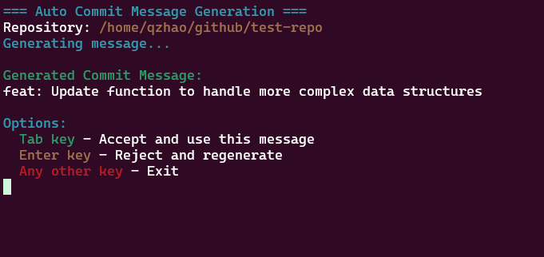

# auto-commit
Git Commit Message Auto-Generation Tool Using Python

## Table of Contents
1. [Introduction](#introduction)
2. [Features](#features)
3. [Installation](#installation)
4. [Usage](#usage)
5. [Configuration](#configuration)
6. [License](#license)

## Introduction
The `auto-commit` is a Python-based utility designed to automatically generate meaningful Git commit messages. It analyzes changes in your Git repository and produces descriptive commit messages, saving you time and ensuring consistent commit message formatting.

## Features
- **Automatic Analysis**: Scans staged changes (after `git add` or `git rm`) to generate relevant commit messages, aligning with standard Git workflows.
- **Git Integration**: Seamlessly integrates with Git workflow through `git auto-commit` alias after installation.
- **Interactive CLI**: Generates commit messages through an interactive command-line interface.
- **Multiple Templates**: Supports different commit message templates to suit various workflows.
- **Customizable Rules**: Allows users to define custom rules for commit message generation.

## Installation
### Automated Installation
We provide an installation script (`install.sh`) that handles:
1. Creating a Python virtual environment (`venv`) and installing dependencies
2. Deploying the `auto-commit.sh` script to your home directory (`~/.auto-commit.sh`)
3. Setting up the Git alias `git auto-commit`

Run the installer with:
```bash
chmod +x install.sh && ./install.sh
```

### Manual Installation (Advanced)
For custom setups, you can:

1. Modify the script template from `scripts/auto-commit.sh`
```bash
cp scripts/auto-commit.sh ~/.auto-commit.sh
vi ~/.auto-commit.sh  # Make your custom edits
```
2. Set execute permissions:
```bash
chmod +x ~/.auto-commit.sh
```
3. Create Git alias manually:
```bash
git config --global alias.auto-commit '!f() { ~/.auto-commit.sh; }; f'
```

## Usage
To use the `auto-commit` tool, run the following command:

```bash
git auto-commit
```
This will open an interactive CLI where you can select the commit message template and provide any additional information.



Example workflow showing:

1. Running `git auto-commit` after staging changes
2. Reviewing the generated commit message on interactive mode
3. Using `Tab` to accept or `Enter` to regenerate


## Configuration

### Environment Variables

The file `.env` in your project root configures AI parameters:

```ini
# Local AI Settings
LLM_MODEL = "qwen2.5:0.5b"       # Model name/version
LLM_HOST = "http://localhost:11434"  # Local AI server URL

# OpenAI Settings (alternative)
OPENAI_API_KEY = ""              # Required for OpenAI API
OPENAI_API_BASE = "https://api.openai.com/v1"  # OpenAI endpoint

# Generation Parameters
SYSTEM_PROMPT = ""               # Custom instruction template
TIMEOUT = 60                     # API timeout in seconds
MAX_TOKENS = 2000                # Max response length
TEMPERATURE = 0.8                # Creativity vs determinism (0-1)
```

### Prompt Customization

Modify `src/template/system_prompt.j2` to change AI behavior:
```jinja2
{# Example customization - Add new commit type rule #}
You are an expert software engineer analyzing Git changes...
```

## License
This project is licensed under the MIT License. See the LICENSE file for details.
