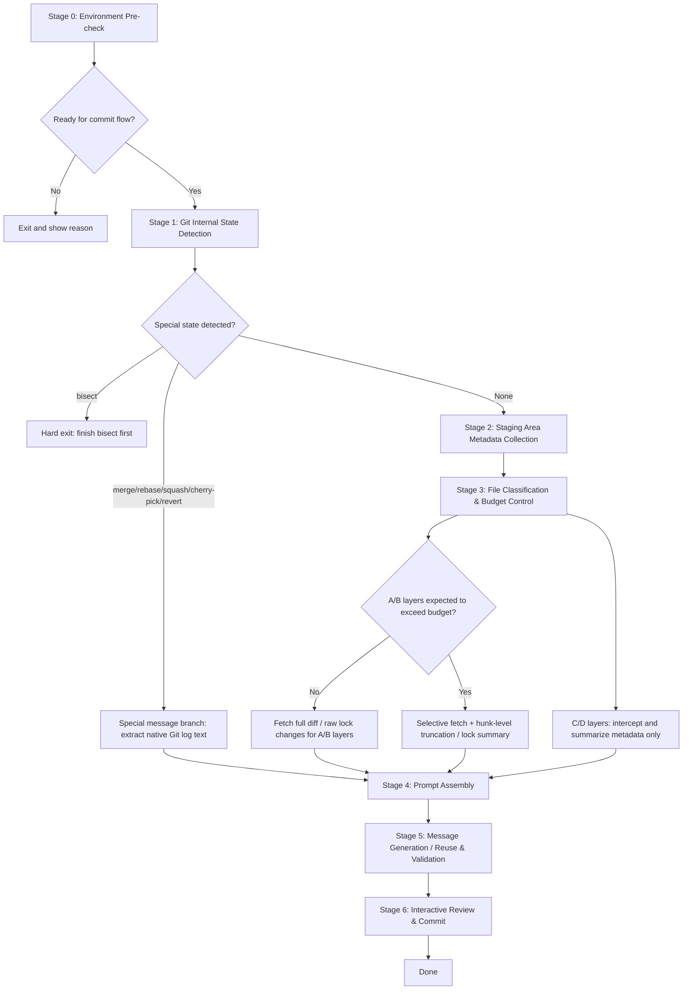

```mermaid
flowchart TD
    A[Stage 0: Environment Pre-check] --> B{Ready for commit flow?}
    B -- No --> X1[Exit and show reason]
    B -- Yes --> C[Stage 1: Git Internal State Detection]

    C --> D{Special state detected?}
    D -- bisect --> X2[Hard exit: finish bisect first]
    D -- merge/rebase/squash/cherry-pick/revert --> S[Special message branch: extract native Git log text]
    D -- None --> E[Stage 2: Staging Area Metadata Collection]

    E --> F[Stage 3: File Classification & Budget Control]
    
    F --> I{A/B layers expected to exceed budget?}
    I -- No --> J[Fetch full diff / raw lock changes for A/B layers]
    I -- Yes --> K[Selective fetch + hunk-level truncation / lock summary]

    F --> H[C/D layers: intercept and summarize metadata only]

    S --> L[Stage 4: Prompt Assembly]
    J --> L
    K --> L
    H --> L

    L --> M[Stage 5: Message Generation / Reuse & Validation]
    M --> N[Stage 6: Interactive Review & Commit]
    N --> Z[Done]
```
