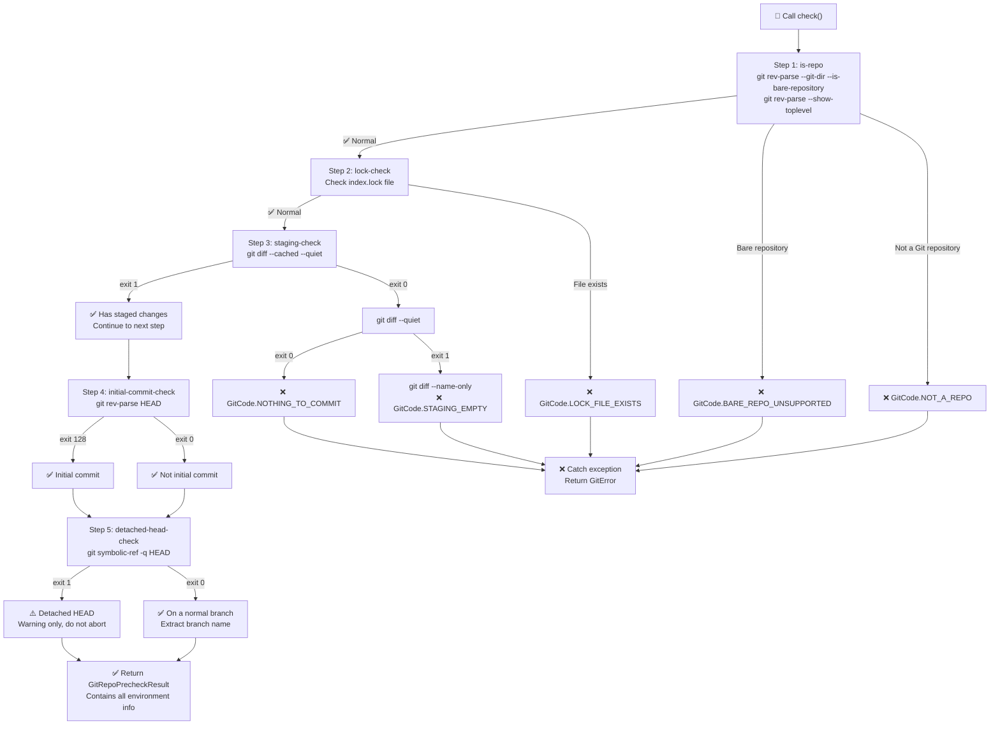

```mermaid
graph TD
    A["🚀 Call check()"] --> B["Step 1: is-repo<br/>git rev-parse --git-dir --is-bare-repository<br/>git rev-parse --show-toplevel"]
    B -->|Not a Git repository| B1["❌ GitCode.NOT_A_REPO"]
    B -->|Bare repository| B2["❌ GitCode.BARE_REPO_UNSUPPORTED"]
    B -->|✅ Normal| C["Step 2: lock-check<br/>Check index.lock file"]
    
    C -->|File exists| C1["❌ GitCode.LOCK_FILE_EXISTS"]
    C -->|✅ Normal| D["Step 3: staging-check<br/>git diff --cached --quiet"]
    
    D -->|exit 1| D1["✅ Has staged changes<br/>Continue to next step"]
    D -->|exit 0| D2["git diff --quiet"]
    D2 -->|exit 1| D3["git diff --name-only<br/>❌ GitCode.STAGING_EMPTY"]
    D2 -->|exit 0| D4["❌ GitCode.NOTHING_TO_COMMIT"]
    
    D1 --> E["Step 4: initial-commit-check<br/>git rev-parse HEAD"]
    E -->|exit 0| E1["✅ Not initial commit"]
    E -->|exit 128| E2["✅ Initial commit"]
    
    E1 --> F["Step 5: detached-head-check<br/>git symbolic-ref -q HEAD"]
    E2 --> F
    
    F -->|exit 0| F1["✅ On a normal branch<br/>Extract branch name"]
    F -->|exit 1| F2["⚠️ Detached HEAD<br/>Warning only, do not abort"]
    
    F1 --> G["✅ Return GitRepoPrecheckResult<br/>Contains all environment info"]
    F2 --> G
    
    B1 --> H["❌ Catch exception<br/>Return GitError"]
    B2 --> H
    C1 --> H
    D3 --> H
    D4 --> H
```