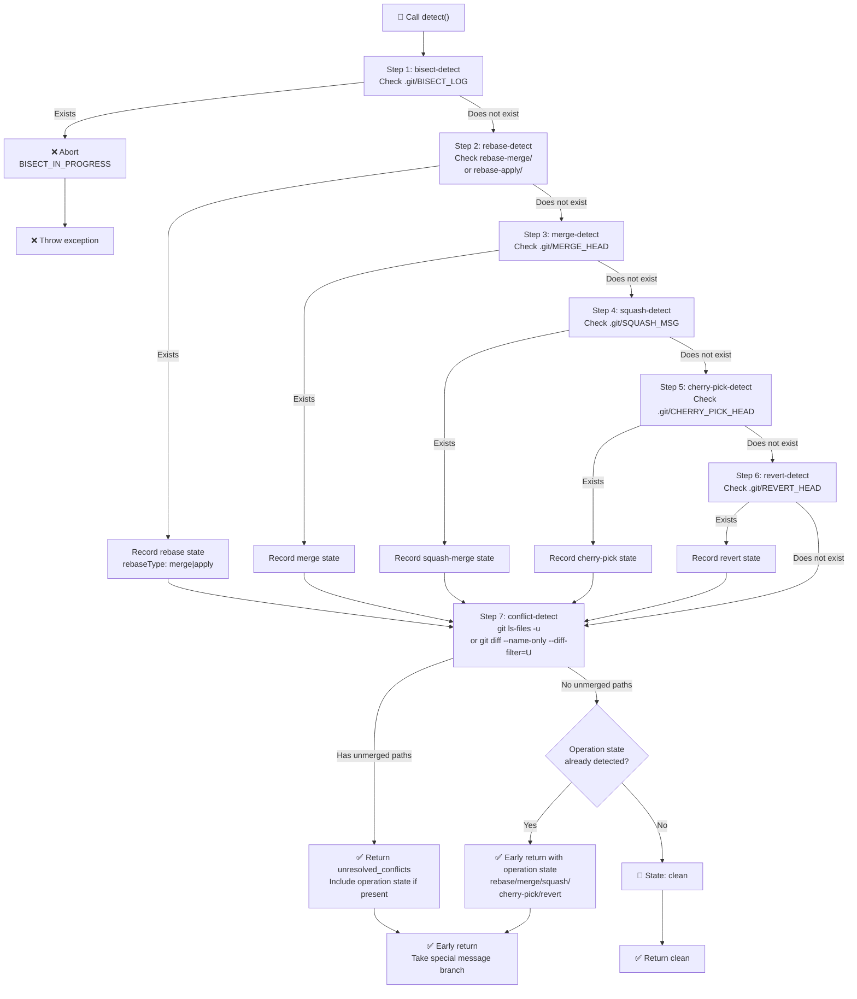

```mermaid
graph TD
    A["🚀 Call detect()"] --> B["Step 1: bisect-detect<br/>Check .git/BISECT_LOG"]
    B -->|Exists| B1["❌ Abort<br/>BISECT_IN_PROGRESS"]
    B -->|Does not exist| C["Step 2: rebase-detect<br/>Check rebase-merge/<br/>or rebase-apply/"]

    C -->|Exists| C0["Record rebase state<br/>rebaseType: merge|apply"]
    C -->|Does not exist| D["Step 3: merge-detect<br/>Check .git/MERGE_HEAD"]

    D -->|Exists| D0["Record merge state"]
    D -->|Does not exist| E["Step 4: squash-detect<br/>Check .git/SQUASH_MSG"]

    E -->|Exists| E0["Record squash-merge state"]
    E -->|Does not exist| F["Step 5: cherry-pick-detect<br/>Check .git/CHERRY_PICK_HEAD"]

    F -->|Exists| F0["Record cherry-pick state"]
    F -->|Does not exist| G["Step 6: revert-detect<br/>Check .git/REVERT_HEAD"]

    G -->|Exists| G0["Record revert state"]
    G -->|Does not exist| I

    C0 --> I
    D0 --> I
    E0 --> I
    F0 --> I
    G0 --> I

    I["Step 7: conflict-detect<br/>git ls-files -u<br/>or git diff --name-only --diff-filter=U"]

    I -->|Has unmerged paths| I1["✅ Return unresolved_conflicts<br/>Include operation state if present"]
    I -->|No unmerged paths| J{"Operation state<br/>already detected?"}

    J -->|Yes| J1["✅ Early return with operation state<br/>rebase/merge/squash/<br/>cherry-pick/revert"]
    J -->|No| H["🎉 State: clean"]

    B1 --> Z["❌ Throw exception"]
    I1 --> Z1["✅ Early return<br/>Take special message branch"]
    J1 --> Z1
    H --> Z2["✅ Return clean"]
```
